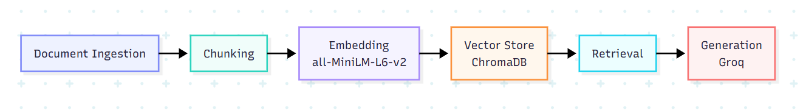

# Project 1 Planning: The Unofficial Guide

> Write this document before you write any pipeline code.
> Your spec and architecture diagram are what you'll use to direct AI tools (Claude, Copilot, etc.) to generate your implementation — the more specific they are, the more useful the generated code will be.
> Update the Retrieval Approach and Chunking Strategy sections if you change your approach during implementation.
> Update this file before starting any stretch features.

---

## Domain

<!-- What domain did you choose? Why is this knowledge valuable and hard to find through official channels? -->
My domain is "Finding and joining clubs at Brown University". This knowledge is valuable because it contains both official statistics and guidelines, as well as firsthand expereinces from clubs. Additionaly, this information is hard to find through official channels because they don't detail the application processes, club culture, or experience. 

---

## Documents

<!-- List your specific sources: URLs, subreddit names, forum threads, or file descriptions.
     Aim for at least 10 sources that together cover different subtopics or perspectives within your domain. -->

| # | Source | Description | URL or location |
|---|--------|-------------|-----------------|
| 1 | Student Activities List | A list of all the current student groups at Brown | https://studentactivities.brown.edu/student-groups/undergraduate-student-groups |
| 2 | Category Breakdown | A simple breakdown of the activity and spending categories of clubs | https://www.brownucs.org/category-breakdown |
| 3 | Reddit: Club Recommendations | Students recommending specific clubs and extracurriculars to join at Brown | https://www.reddit.com/r/BrownU/comments/14dig65/any_ideas_for_clubs_to_join_or_extracurriculars/ |
| 4 | Club culture | A BDH article detailing the club culture at Brown | https://www.browndailyherald.com/article/2024/10/cutthroat-or-collaborative-is-browns-club-culture-competitive |
| 5 | Most Prestigious Clubs | Breifly describes "prestigious" clubs on campus | https://www.collegevine.com/faq/154640/what-are-the-most-prestigious-student-organizations-at-brown-university |
| 6 | HerCampus Guide | A guide on how to approach joining clubs as a woman | https://www.hercampus.com/school/brown/a-guide-to-clubs-at-brown-two-tips-for-success/ |
| 7 | Overview  | Provides an overview of clubs at brown with FAQ | https://admissionsight.com/brown-university-clubs/ |
| 8 | Application Process | Provides information of the application processes for some clubs | https://www.browndailyherald.com/article/2020/01/schmidt-21-university-student-organizations-have-room-to-be-more-inclusive |
| 9 | Pre-Professional Club Selectivity | BDH article on the influx of first-year applicants to pre-professional clubs| https://www.browndailyherald.com/article/2025/10/pre-professional-club-leaders-note-influx-of-eager-first-year-applicants |
| 10 | Activities Fair Experience | Description of how clubs present themselves and recruit new members at the activity fair | https://www.browndailyherald.com/article/2025/09/student-activities-fair-welcomes-first-years-with-music-treats-and-pirate-games |

---

## Chunking Strategy

<!-- How will you split documents into chunks?
     State your chunk size (in tokens or characters), overlap size, and explain why those
     numbers fit the structure of your documents.
     A review-heavy corpus warrants different chunking than a long FAQ. -->

**Chunk size: 600** 

**Overlap: 50**

**Reasoning:** I'll be using recursive chunking due to the varying structures of the documents. The chunk size of 600 with overlap of 50 will allow for context of large paragraphs of articles to be maintained.

---

## Retrieval Approach

<!-- Which embedding model are you using (e.g., all-MiniLM-L6-v2 via sentence-transformers)?
     How many chunks will you retrieve per query (top-k)?
     If you were deploying this for real users and cost wasn't a constraint, what tradeoffs
     would you weigh in choosing a different embedding model — context length, multilingual
     support, accuracy on domain-specific text, latency? -->

**Embedding model: all-MiniLM-L6-v2 via sentence-transformers**

**Top-k: 5**

**Production tradeoff reflection: If I was deploying this to real users, I would weigh accuracy on domain-specific text and context length the most. This is because the guide must retrive the correct information from official documentation, and it must be able to asess the context from various articles and forums in order to have the most accurate response.**

---

## Evaluation Plan

<!-- List your 5 test questions with their expected correct answers.
     Questions should be specific enough that you can judge whether the system's response
     is right or wrong. "What are good dining halls?" is too vague.
     "What do students say about wait times at [dining hall name] during lunch?" is testable. -->

| # | Question | Expected answer |
|---|----------|-----------------|
| 1 | Is BIG a competitive club? | Yes, there are many applicants |
| 2 | How many social action groups are there? | There are currently 30 Social Action student groups at Brown. |
| 3 | Is there an event where I can find clubs? | The activity fair|
| 4 | How selective are pre-professional clubs? | The finance and consulting pre-professional clubs are extremely competitive with hundreds of applicants each semester |
| 5 | Is there an Alexander Hamilton club at Brown| Yes, Brown has the Alexander Hamilton Society |

---

## Anticipated Challenges

<!-- What could go wrong? Name at least two specific risks with reasoning.
     Consider: noisy or inconsistent documents, missing source attribution, off-topic
     retrieval, chunks that split key information across boundaries. -->

1. The application process and club experienecs are only available for a few clubs, so retrieval may be vauge, or completely inacurrate due to the inconsistent documents. 

2. Some information is displayed through images rather than text, so it may not be retrieved properly. 

3. There is conflicting information between the documents (e.g. total number of clubs), which may lead to false retrieval due to the outdated information.

---

## Architecture

<!-- Draw a diagram of your pipeline showing the five stages:
     Document Ingestion → Chunking → Embedding + Vector Store → Retrieval → Generation
     Label each stage with the tool or library you're using.
     You can use ASCII art, a Mermaid diagram, or embed a sketch as an image.
     You'll use this diagram as context when prompting AI tools to implement each stage. -->
---
config:
  layout: elk
---
graph LR
    A[Document Ingestion] --> B[Chunking]
    B --> C[Embedding all-MiniLM-L6-v2]
    C --> D[Vector Store ChromaDB]
    D --> E[Retrieval]
    E --> F[Generation Groq]
    
    classDef ingestion stroke:#818cf8,fill:#eef2ff
    classDef processing stroke:#2dd4bf,fill:#f0fdfa
    classDef embedding stroke:#a78bfa,fill:#f5f3ff
    classDef storage stroke:#fb923c,fill:#fff7ed
    classDef retrieval stroke:#22d3ee,fill:#ecfeff
    classDef generation stroke:#f87171,fill:#fef2f2
    
    class A ingestion
    class B processing
    class C embedding
    class D storage
    class E retrieval
    class F generation

---

## AI Tool Plan

<!-- For each part of the pipeline below, describe:
     - Which AI tool you plan to use (Claude, Copilot, ChatGPT, etc.)
     - What you'll give it as input (which sections of this planning.md, which requirements)
     - What you expect it to produce
     - How you'll verify the output matches your spec

     "I'll use AI to help me code" is not a plan.
     "I'll give Claude my Chunking Strategy section and ask it to implement chunk_text()
     with my specified chunk size and overlap" is a plan. -->
     
     I'll be using Claude for each step

     Background: I'll give claude the context of my project and the overall goal I'm trying to achieve.
     
     Document Ingestion:
     Input: My documents table
     Output: A load_documents() function that fetches and extracts plain text from each URL. 
     To verify, I'll ask it to print the first 200 characters of each loaded document to confirm clean text was extracted

     Chunking:
     Input: My chunking strategy section (recursive chunking, chunk size 600, overlap 50)
     Output: A chunk_text() function using my exact parameters
     To verify I'll print chunk count and a sample chunk to confirm size looks right and no chunks are getting cut mid-sentence awkwardly

     Embedding + Vector Store:
     Input: My retrieval section specifying all-MiniLM-L6-v2 and ChromaDB
     Output: Code that embeds chunks and stores them in a local ChromaDB collection
     To verify, ask ChromaDB for a known term (e.g. "activities fair") and confirm correct chunks come back

     Retrieval:
     Input: My retrieval section specifying top-k of 5
     Output: A retrieve() function that takes a query string and returns the top 5 chunks

     Generation:
     Input: My architecture diagram showing Groq as the generation step, plus a description of the prompt format (system prompt + retrieved chunks + user question)
     Output: A generate() function that formats the prompt and calls the Groq API
     To verify I'll run my test questions.

**Milestone 3 — Ingestion and chunking:**

**Milestone 4 — Embedding and retrieval:**

**Milestone 5 — Generation and interface:**

Minimal working interface example
import gradio as gr
from query import ask  # or wherever your end-to-end function lives

def handle_query(question):
    result = ask(question)
    sources = "\n".join(f"• {s}" for s in result["sources"])
    return result["answer"], sources

with gr.Blocks() as demo:
    inp = gr.Textbox(label="Your question")
    btn = gr.Button("Ask")
    answer = gr.Textbox(label="Answer", lines=8)
    sources = gr.Textbox(label="Retrieved from", lines=4)
    btn.click(handle_query, inputs=inp, outputs=[answer, sources])
    inp.submit(handle_query, inputs=inp, outputs=[answer, sources])

demo.launch()

Groq initialization steps:
use Groq's  default llama-3.3-70b-versatile
itialize it with from groq import Groq and my GROQ_API_KEY from .env
